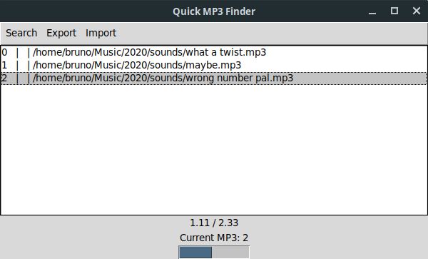

# Quick MP3 finder
Find all MP3 files, preview, set to favorites and extract them as playlist.

# Requirements
- installed VLC Player

# Installation
### Linux
1. create virtual environment

`python -m venv .env`

2. activate environment

`. .env/bin/activate`

3. install dependencies

`pip install -r requirements.txt`

### Windows
1. create virtual environment

`python -m venv .env`

2. activate environment with powershell

`.env/Scripts/activate.ps1`

3. install dependencies

`pip install -r requirements.txt`

4. (optional) create exe

execute `make_exe.bat`

# Controls

run with: `python mp3rater.py`

Key | Function
----| --------
up / down arrow | select tracks
left / right arrow | rewind / fast forward
space | play / pause
enter | toggle favorite

# Import / Export
export saves playlist file as `playlist.m3u`